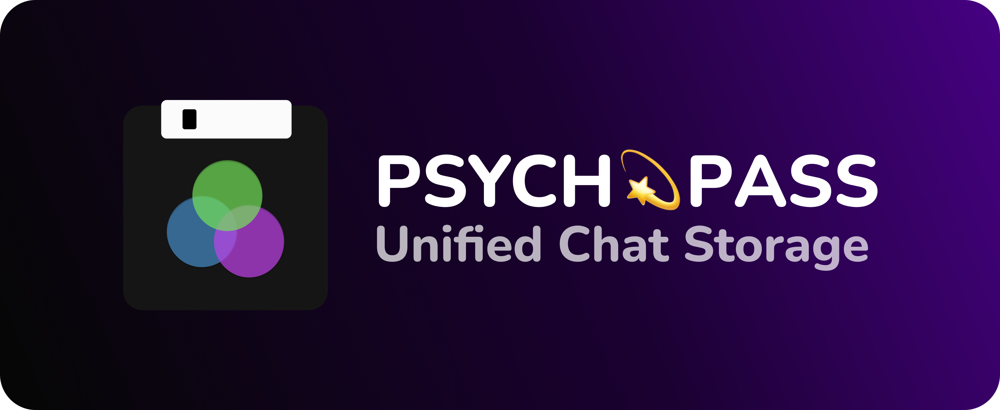
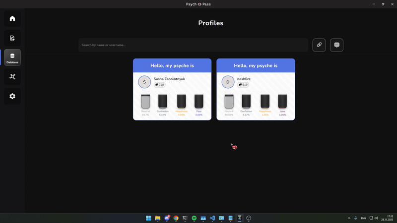

# PSYCHOPASS

  

#### Built with:

  
  
  

---

## Project Info

**Psychopass** is just a fun side project built around an **emotion classifier**, but I also designed it to be a **useful and easy-to-use chat storage**.  It lets you store chats you may not need anymore or want to remove from your messengers without losing them completely.

If you think this project is any cool consider giving it a **star** I would really appreciate that! (*≧ω≦*)

---

## Downloads

For more see [Releases](https://github.com/desh0cc/psychopass/releases)

| Platform        | Version | Download | Tested |
|-----------------|---------|----------|--------|
| Windows 64-bit  | 0.2.0   | [Download](https://github.com/desh0cc/psychopass/releases/download/0.2.0/psychopass_0.2.0_x64_en-US.msi) | False |
| macOS           | 0.2.0   | [Download]() | False |
| Linux           | 0.2.0   | [Download]() | False |

---

## Main Features

### Fully Local
All messages are stored in a local **SQLite3 database** on your device so all your data stays with you.

### Emotion Classifier
Sorts your messages by emotion so you can explore and rediscover old messages as well as the ones you may not want to see anymore 👀  
Basically acts as the non-chronological message provider to make storing chats more interesting.

### Database Management
- Change avatars, names, and manage **your data** however you want  
- **. . . LINK AND MERGE! . . .**
  - 
  - Merge different accounts into one for easy profile management

### Memory Search
Search your messages with **both vector and linear search engines**.

---

## Contribute

If you know how to make this application more useful, consider making a [Feature Request](https://github.com/desh0cc/psychopass/issues/new?template=feature_request.md).
  I’ll try to implement the idea if it’s interesting :p

---

## License

This project is licensed under the terms of the [*GPLv3*](LICENSE).
